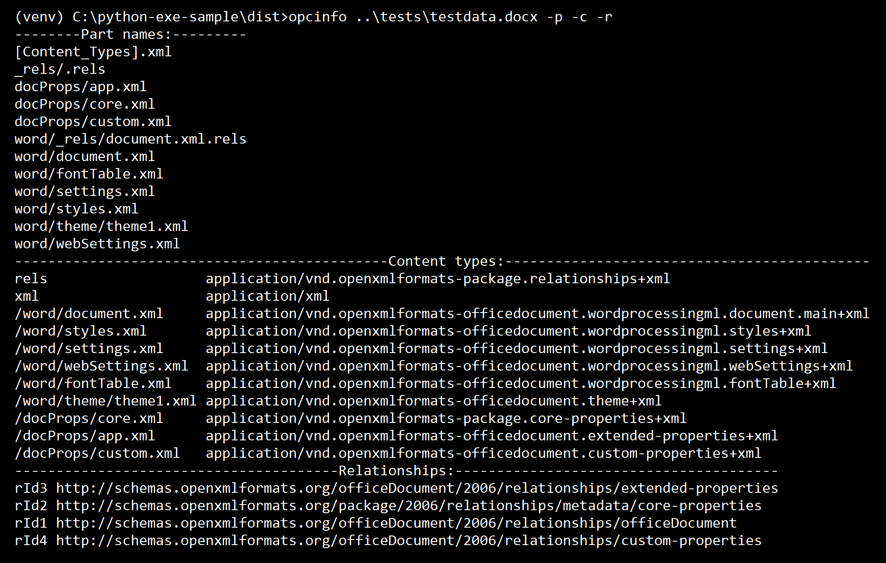

# creating an executable from Python code

This repo provides a simple example of how to create a single-file Windows executable from a Python app using [PyInstaller](http://www.pyinstaller.org/).

The general approach is largely based on Luke Lee's excellent Real Python article [Using PyInstaller to Easily Distribute Python Applications](https://realpython.com/pyinstaller-python/). That article targets Linux platforms, and in this sample I've tweaked a few things to make it work on Windows. Note that PyInstaller doesn't support cross-platform builds, so you need to build the executable on the same platform you're deploying to.

## Installation
* Install Python (version 3.6 or higher).
* Clone this repo
* Recommended: create a virtual environment (e.g., ```python -m venv venv```) and activate it.
* In the root folder of the cloned repo, use the command ```python -m pip install -r requirements.txt``` to install dependencies.
* Install the ```opcreader``` package with the command ```pip install --editable .``` in the root folder.

## Usage
After you've cloned the repo and installed dependencies, you should be able to build an executable by executing the build command in ```build-windows-exe.bat```. Console output is quite verbose, and when it's done running you will have an ```opcinfo.exe``` file in the ```dist``` subfolder.

To verify that the EXE is working correctly go into the ```dist```folder and try running the executable against one of the test files. For example:



For command syntax, see the output of ```opcinfo -h```.

## Contributing
This project is a work in progress, and pull requests, feature requests and issues are welcome. Feel free to [log an issue](https://github.com/dmahugh/azure-key-vault/issues) if you have a suggestion. Thanks!

## License
This project is licensed under the [MIT License](https://github.com/dmahugh/azure-key-vault/blob/master/LICENSE).


